#基于角定位与区域分割的多向文本检测方法
##1.摘要
过去文本检测分类：
```
text box location regeression
segments text regions, and complex post-processing
```
本文：
```
combines both
```
解决的问题：
```
1.因为我们是通过对角点进行采样和分组来检测场景文本的，所以新的方法能够处理任意方向的文本
2.因为我们检测的是角点，而不是边界框，所以新的方法可以自然地避免边框比较大的问题
3.因为使用了位置敏感分割，所以无论是字符、单词，还是文本行，我们都能够较好地分割文本实例
4.在新方法中，候选边框的边界是由角点决定的。
```
想法及流程：
```
1.不管矩形的大小如何、长宽比如何、方向如何，它都可以由角点决定
2.区域分割图可以提供有效的文本位置信息。所以，我们可以首先检测文本的角点（左上角、右上角、右下角和左下角）（如图 1 所示），而不是直接检测文本边界框。
3.我们预测位置敏感分割图（如图 1 所示），而不是文本/非文本图。最后，我们再通过角点进行采样和分组，以生成候选边界框，并通过分割信息消除不合理的边框。
```

#2.总体思路
```
1.detect the corner points(top-left,top-right,b-l,b-r)
2.predict position-senditive segmentation maps(not text/non-text maps)
3.generate candidate bounding boxes by sampling .And grouping the detected corner points .
4.Then eliminate unreasonable boxes by segmentation information
```
如图

#3.网络结构
网络结构如图：
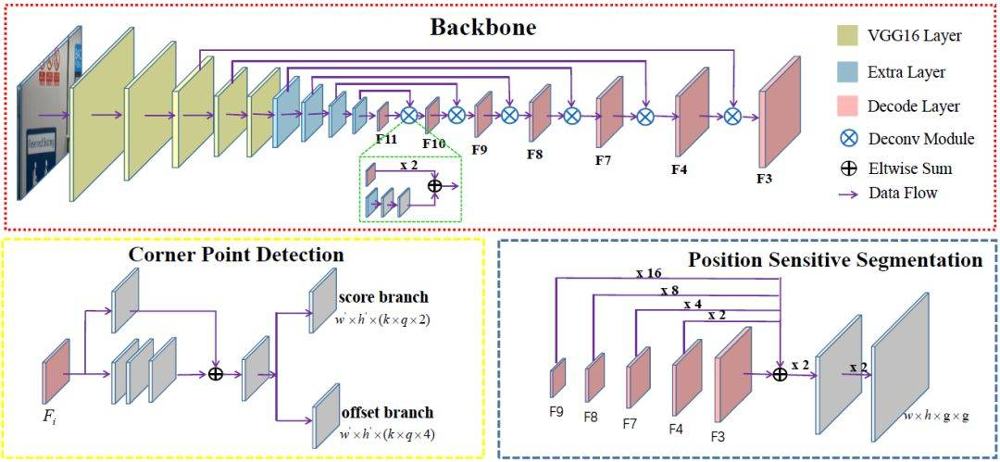
结构分析：
```
1.fully convolutional network
2.feature extraction
3.corner detection
4.position-sensitive segmentation
5.NMS
```
##3.1 Feature Extraction
1. pre-trained VGG16(黄色，去掉了sequence和分类层, 加了俩层卷积命名为conv6、conv7) to extract features
2. extra convolution layers(蓝色，conv８ ~ conv11) to enlarge the receptive fileds of extracted features.
3. deconvolution modules proposed in [DSSD](#DSSD)/[FNP](#FNP)(粉色，引用DSSD结构) to detect different size text well.

##3.2 Corner Detection
rotated box $R = (x, y, w, h, \theta)$ ,切换为二维坐标点则需要预测的四个点的坐标为$\{(x_1,y_1),(x_2,y_2),(x_3,y_3),(x_4,y_4)\}$
但为方便，再重新定义$(x_c,y_c)$坐标为一个**水平**方块即$(x_c,y_c,ss,ss)$，其中ｃ可取1234, ss为box R的短边边长。

不同与SSD和DSSD的anchor box, where each box 输出置信度和候选框的相对偏移，corner points detection 的话可能一个相同的location可以同时有多个corner point, 所以在本文中一个anchor box 应该输出对四个corner point 的置信度和相对偏移
本文采用了DSSD的方法在两个分支用卷积的方法预测置信度和相对偏移，如上图所示若feature map 为m×n每个格子预测k种anchor box则对与置信度来说有n×m×(k×q×2) 对与相对偏移来说有n×m×(k×q×4) ,其中ｑ代表有多少种corner point本文有４种，２代表为两类（是的置信度，否的置信度），４代表坐标位置的偏移（x,y,w,h)
每个decode layer的输出本文使用SSD的anchor box and ground truth ones, the scales 如下图，默认aspect ratios为１．

##3.3 Position-Sensitive Segmentation
###pass: 
get the probability of each pixel belong to text regions.这样的语义分割对与之后的文字识别效果很差需要复杂的后期处理to get the text bounding boxes.
###本文: 
use position-sensitive segmentation to generate text segmentation maps(inspired by InstanceFCN).将一个bounding box分为２×2　小份，对于每个小份语义图需要确定每个像素属于哪个小份（每个小份的性质不同，例如人体可以分为头，胳膊，腿等）

输出：
本文利用一个全卷积神经网络继续输出语义信息将之前的features of f34789 分别扩大１２４８16 倍使其和f3相同一起输出为inputimage.shape×（２×２），其中(2×2)代表属于哪部分（top-left.....)
<span id = "network"></span>


##背景
###<span id = "FNP">FNP</span>
>In Computer Vision中,利用不同尺度来做目标识别一直是个大坑(fundamental challenge)。
>featureized image pyramids(Feature pyramids built upon image pyramids)是一个基本处理方法。示意图如下:
>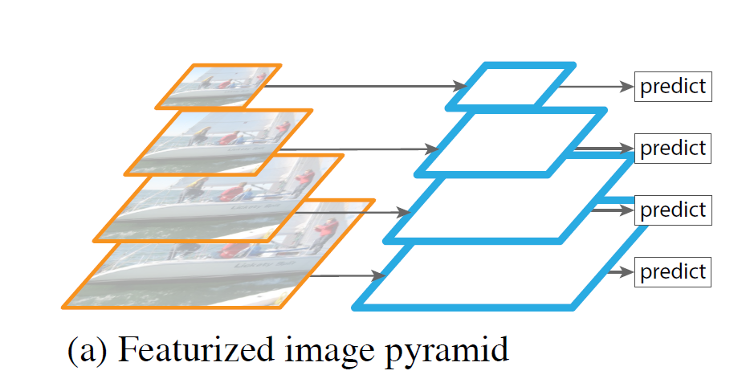
>Featureized image pyramids需要以下操作：
>```
>先做image pyramid，展成不同尺度的image
>提取不同尺寸的image的feature map
>知道如何整Featureized image pyramids，也就很明白这个方法的问题所在：慢！
>```
>[SSD](#SSD)是第一个吃螃蟹的，即使用ConvNet’s pyramidal feature hierarchy。SSD复用了不同layer上的feature maps(前馈网络已经计算了，没有额外的计算)。但是SSD只是从较为高层的feature maps开始计算的(论文是Conv43)，并添加了几个CONV层提取特征。
>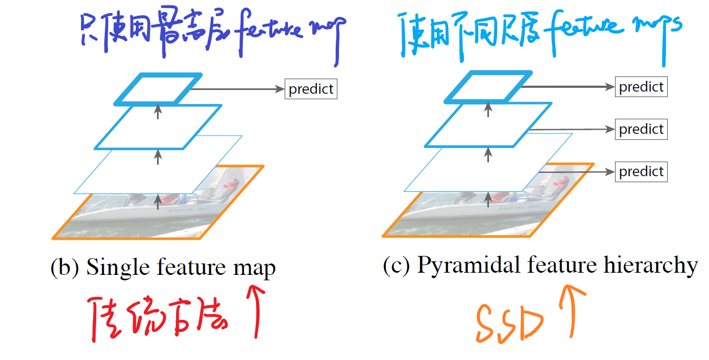
>SSD的问题在于没有充分利用不同尺度的feature maps，尤其是底层高分辨率的feature maps，这些high-resolution的feature maps对small objects的检测尤为的重要。
>####FPN思路
>FPN的思路是:ConvNet的多个layer提取出的不同尺度的feature maps，这形成一个pyramid hierarchy，从上到下建立一个top-down pathway and lateral connections。(这个top-down的path就是用高层的特征来弥补底层的特征，从而得到高分辨率、强语义的预测，也就是弥补了上面不同尺度feature map之间通道不同存在的large segmantic gaps)
>FPN和SSD和一些其他方法[1],[2]的比较如下:
>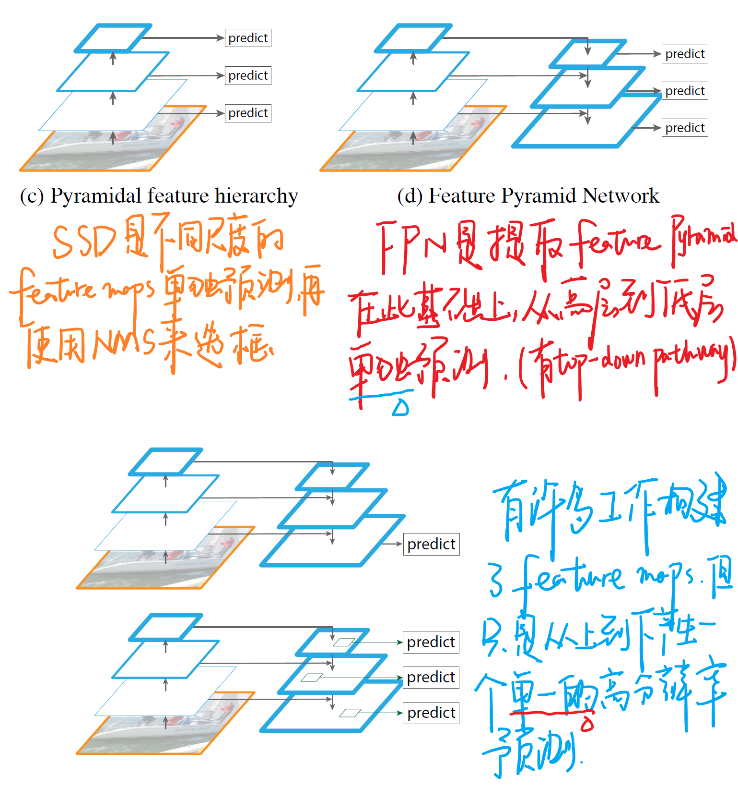
>Bottom-up pathway
ConvNet’s的forward计算是自下而上的，特征图经过卷积核计算，会以成倍的比例缩小(pooling layer的原因)。但同时有需多卷积层输出的feature map的尺寸是一样的，针对输出一样大小的feature map的卷积层我们统称为stage。

>以stage为单位，我们在构建feature pyramid时，以每个’stage’为一个pyramid level，取每个stage最后layer输出的feature map作为pyramid level。至于为什么会这么取？论文说是:这样取是理所当然的，因为靠后的layer有着更强壮的feature。

>Top-down pathway and lateral connections
>如何实现Top-down pathway？
>前面我们得到了一个高语义的feature pyramid。 高层的feature map有着强语义，大感受野的的特性，底层的feature map有着high-resolution，并且保留对small object的语义。在构建好的feature pyramid上，要设法连接高层和底层，充分利用不同层feature map的特性。那么该怎么连接？

>FPN的做法是: 将高层的feature map上采样得到高分辨率的feature map，再与其在pyramid内下一个level的feature map做横向连接(lateral connections)。这样可以让高层特征得到加强。同时保证横向连接的两层特征在空间尺寸上要相同。这样做是为了利用底层的high-resolution的特性。
>上图是构建top-down pathway的细节：
```
高层feature上采样，采用最邻近上采样法(用这个方法是图简便)，spatial resolution放大2倍。处理后的feature map记为mapup
底层feature经过1×1的卷积layer,让feature的通道数和高层的feature map相同。处理后的feature map记为mapdown(论文中说的是reduce通道数，难道不是增加吗？)
将mapup和mapdown做像素相加(element-wise addition)，迭代直到产生finest resolution map
迭代后，在每个合并的feature map上使用3×3卷积得到最终map。（为了减少上采样过程中混叠效应）
```
>*不同深度的 feature map 为什么可以经过upsample后直接相加？*
>作者解释说这个原因在于我们做了end-to-end的 training，因为不同层的参数不是固定的，不同层同时给监督做 end-to-end training，所以相加训练出来的东西能够更有效地融合浅层和深层的信息。
>FNP架构细节
>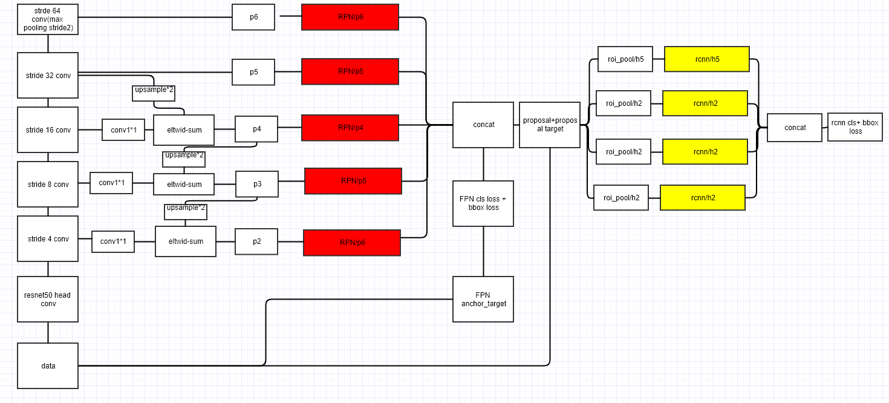
>##[返回](#network)

###<span id = "SSD">SSD</span>
>[原文](https://zhuanlan.zhihu.com/p/33544892 "Title")
>SSD和Yolo一样都是采用一个CNN网络来进行检测，但是却采用了多尺度的特征图，其基本架构如图
>
>（1）采用多尺度特征图用于检测
>所谓多尺度采用大小不同的特征图，CNN网络一般前面的特征图比较大，后面会逐渐采用stride=2的卷积或者pool来降低特征图大小，这正如图3所示，一个比较大的特征图和一个比较小的特征图，它们都用来做检测。这样做的好处是比较大的特征图来用来检测相对较小的目标，而小的特征图负责检测大目标，如图4所示，8x8的特征图可以划分更多的单元，但是其每个单元的先验框尺度比较小。
>
>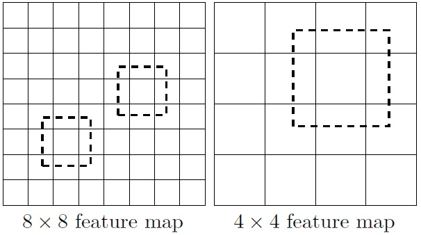
>（2）采用卷积进行检测
>与Yolo最后采用全连接层不同，SSD直接采用卷积对不同的特征图来进行提取检测结果。对于形状为 m×n×p 的特征图，只需要采用 3×3×p 这样比较小的卷积核得到检测值。
>（3）设置先验框
>在Yolo中，每个单元预测多个边界框，但是其都是相对这个单元本身（正方块），但是真实目标的形状是多变的，Yolo需要在训练过程中自适应目标的形状。而SSD借鉴了Faster R-CNN中anchor的理念，每个单元设置尺度或者长宽比不同的先验框，预测的边界框（bounding boxes）是以这些先验框为基准的，在一定程度上减少训练难度。一般情况下，每个单元会设置多个先验框，其尺度和长宽比存在差异，如图5所示，可以看到每个单元使用了4个不同的先验框，图片中猫和狗分别采用最适合它们形状的先验框来进行训练，后面会详细讲解训练过程中的先验框匹配原则。
>#####detail
>SSD的检测值也与Yolo不太一样。对于每个单元的每个先验框，其都输出一套独立的检测值，对应一个边界框，主要分为两个部分。第一部分是各个类别的置信度或者评分，值得注意的是SSD将背景也当做了一个特殊的类别，如果检测目标共有 c 个类别，SSD其实需要预测 c+1 个置信度值，其中第一个置信度指的是不含目标或者属于背景的评分。后面当我们说 c 个类别置信度时，请记住里面包含背景那个特殊的类别，即真实的检测类别只有 c-1 个。在预测过程中，置信度最高的那个类别就是边界框所属的类别，特别地，当第一个置信度值最高时，表示边界框中并不包含目标。第二部分就是边界框的location，包含4个值 (cx, cy, w, h) ，分别表示边界框的中心坐标以及宽高。但是真实预测值其实只是边界框相对于先验框的转换值(paper里面说是offset，但是觉得transformation更合适，参见R-CNN)。先验框位置用 $ d=(d^{cx}, d^{cy}, d^w, d^h) 表示，其对应边界框用 b=(b^{cx}, b^{cy}, b^w, b^h) $表示，那么边界框的预测值 l 其实是 b 相对于 d 的转换值：

>$l^{cx} = (b^{cx} - d^{cx})/d^w, \space l^{cy} = (b^{cy} - d^{cy})/d^h$

>$l^{w} = \log(b^{w}/d^w), \space l^{h} = \log(b^{h}/d^h)$

>习惯上，我们称上面这个过程为边界框的编码（encode），预测时，你需要反向这个过程，即进行解码（decode），从预测值 l 中得到边界框的真实位置 b ：

>$b^{cx}=d^w l^{cx} + d^{cx}, \space b^{cy}=d^y l^{cy} + d^{cy}$

>$b^{w}=d^w \exp(l^{w}), \space b^{h}=d^h \exp(l^{h})$
>
>采用VGG16做基础模型，分别将VGG16的全连接层fc6和fc7转换成 3×3 卷积层 conv6和 1×1 卷积层conv7，同时将池化层pool5由原来的stride=2的 2×2 变成stride=1的 3×3 （猜想是不想reduce特征图大小），为了配合这种变化，采用了一种Atrous Algorithm，其实就是conv6采用扩展卷积或带孔卷积（Dilation Conv），其在不增加参数与模型复杂度的条件下指数级扩大卷积的视野，其使用扩张率(dilation rate)参数，来表示扩张的大小，如下图6所示，(a)是普通的 3×3 卷积，其视野就是 3×3 ，(b)是扩张率为1，此时视野变成 7×7 ，(c)扩张率为3时，视野扩大为 15×15 ，但是视野的特征更稀疏了。Conv6采用 3×3 大小但dilation rate=6的扩展卷积。
>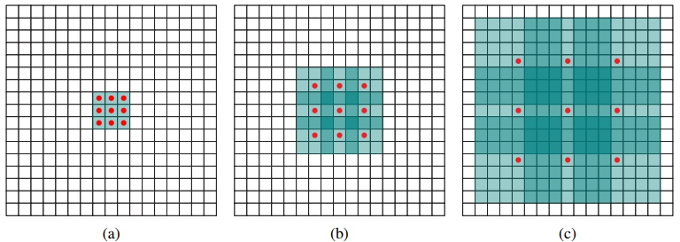
>然后移除dropout层和fc8层，并新增一系列卷积层，在检测数据集上做finetuing。
>其中VGG16中的Conv4_3层将作为用于检测的第一个特征图。conv4_3层特征图大小是 38×38 ，但是该层比较靠前，其norm较大，所以在其后面增加了一个L2 Normalization层（参见ParseNet），以保证和后面的检测层差异不是很大，这个和Batch Normalization层不太一样，其仅仅是对每个像素点在channle维度做归一化，而Batch Normalization层是在[batch_size, width, height]三个维度上做归一化。归一化后一般设置一个可训练的放缩变量gamma。
>从后面新增的卷积层中提取Conv7，Conv8_2，Conv9_2，Conv10_2，Conv11_2作为检测所用的特征图，加上Conv4_3层，共提取了6个特征图，其大小分别是 (38, 38), (19, 19), (10, 10), (5, 5), (3, 3), (1, 1) ，但是不同特征图设置的先验框数目不同（同一个特征图上每个单元设置的先验框是相同的，这里的数目指的是一个单元的先验框数目）。先验框的设置，包括尺度（或者说大小）和长宽比两个方面。对于先验框的尺度，其遵守一个线性递增规则：随着特征图大小降低，先验框尺度线性增加：

>$s_k = s_{min} + \frac{s_{max} - s_{min}}{m-1}(k-1), k\in[1,m]$

>$其中 m 指的特征图个数，但却是 5 ，因为第一层（Conv4_3层）是单独设置的， s_k 表示先验框大小相对于图片的比例，而 s_{min} 和 s_{max} 表示比例的最小值与最大值，paper里面取0.2和0.9。对于第一个特征图，其先验框的尺度比例一般设置为 s_{min}/2=0.1 ，那么尺度为 300\times 0.1=30 。对于后面的特征图，先验框尺度按照上面公式线性增加，但是先将尺度比例先扩大100倍，此时增长步长为 \lfloor \frac{\lfloor s_{max}\times 100\rfloor - \lfloor s_{min}\times 100\rfloor}{m-1}\rfloor=17 ，这样各个特征图的 s_k 为 20, 37, 54, 71, 88 ，将这些比例除以100，然后再乘以图片大小，可以得到各个特征图的尺度为 60,111, 162,213,264 ，这种计算方式是参考SSD的Caffe源码。综上，可以得到各个特征图的先验框尺度 30,60,111, 162,213,264 。对于长宽比，一般选取 a_r\in \{1,2,3,\frac{1}{2},\frac{1}{3}\} ，对于特定的长宽比，按如下公式计算先验框的宽度与高度（后面的 s_k 均指的是先验框实际尺度，而不是尺度比例）：$

>$w^a_{k}=s_k\sqrt{a_r},\space h^a_{k}=s_k/\sqrt{a_r}$

>$默认情况下，每个特征图会有一个 a_r=1 且尺度为 s_k 的先验框，除此之外，还会设置一个尺度为 s'_{k}=\sqrt{s_k s_{k+1}} 且 a_r=1 的先验框，这样每个特征图都设置了两个长宽比为1但大小不同的正方形先验框。注意最后一个特征图需要参考一个虚拟 s_{m+1}=300\times105/100=315 来计算 s'_{m} 。因此，每个特征图一共有 6 个先验框 \{1,2,3,\frac{1}{2},\frac{1}{3},1'\} ，但是在实现时，Conv4_3，Conv10_2和Conv11_2层仅使用4个先验框，它们不使用长宽比为 3,\frac{1}{3} 的先验框。每个单元的先验框的中心点分布在各个单元的中心，即 (\frac{i+0.5}{|f_k|},\frac{j+0.5}{|f_k|}),i,j\in[0, |f_k|) ，其中 |f_k| 为特征图的大小。$

>$得到了特征图之后，需要对特征图进行卷积得到检测结果，图7给出了一个 5\times5 大小的特征图的检测过程。其中Priorbox是得到先验框，前面已经介绍了生成规则。检测值包含两个部分：类别置信度和边界框位置，各采用一次 3\times3 卷积来进行完成。令 n_k 为该特征图所采用的先验框数目，那么类别置信度需要的卷积核数量为 n_k\times c ，而边界框位置需要的卷积核数量为 n_k\times 4 。由于每个先验框都会预测一个边界框，所以SSD300一共可以预测 38\times38\times4+19\times19\times6+10\times10\times6+5\times5\times6+3\times3\times4+1\times1\times4=8732 个边界框，这是一个相当庞大的数字，所以说SSD本质上是密集采样。$
>
>#####训练过程
（1）先验框匹配 
$在训练过程中，首先要确定训练图片中的ground truth（真实目标）与哪个先验框来进行匹配，与之匹配的先验框所对应的边界框将负责预测它。在Yolo中，ground truth的中心落在哪个单元格，该单元格中与其IOU最大的边界框负责预测它。但是在SSD中却完全不一样，SSD的先验框与ground truth的匹配原则主要有两点。首先，对于图片中每个ground truth，找到与其IOU最大的先验框，该先验框与其匹配，这样，可以保证每个ground truth一定与某个先验框匹配。通常称与ground truth匹配的先验框为正样本（其实应该是先验框对应的预测box，不过由于是一一对应的就这样称呼了），反之，若一个先验框没有与任何ground truth进行匹配，那么该先验框只能与背景匹配，就是负样本。一个图片中ground truth是非常少的， 而先验框却很多，如果仅按第一个原则匹配，很多先验框会是负样本，正负样本极其不平衡，所以需要第二个原则。第二个原则是：对于剩余的未匹配先验框，若某个ground truth的 \text{IOU} 大于某个阈值（一般是0.5），那么该先验框也与这个ground truth进行匹配。这意味着某个ground truth可能与多个先验框匹配，这是可以的。但是反过来却不可以，因为一个先验框只能匹配一个ground truth，如果多个ground truth与某个先验框 \text{IOU} 大于阈值，那么先验框只与IOU最大的那个先验框进行匹配。第二个原则一定在第一个原则之后进行，仔细考虑一下这种情况，如果某个ground truth所对应最大 \text{IOU} 小于阈值，并且所匹配的先验框却与另外一个ground truth的 \text{IOU} 大于阈值，那么该先验框应该匹配谁，答案应该是前者，首先要确保某个ground truth一定有一个先验框与之匹配。但是，这种情况我觉得基本上是不存在的。由于先验框很多，某个ground truth的最大 \text{IOU} 肯定大于阈值，所以可能只实施第二个原则既可以了，这里的TensorFlow版本就是只实施了第二个原则，但是这里的Pytorch两个原则都实施了。图8为一个匹配示意图，其中绿色的GT是ground truth，红色为先验框，FP表示负样本，TP表示正样本。$
>先验框匹配示意图
>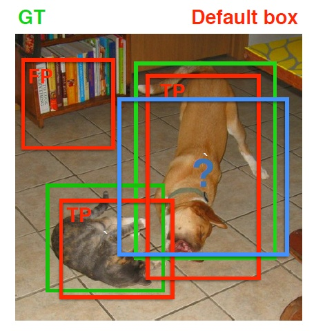
>$尽管一个ground truth可以与多个先验框匹配，但是ground truth相对先验框还是太少了，所以负样本相对正样本会很多。为了保证正负样本尽量平衡，SSD采用了hard negative mining，就是对负样本进行抽样，抽样时按照置信度误差（预测背景的置信度越小，误差越大）进行降序排列，选取误差的较大的top-k作为训练的负样本，以保证正负样本比例接近1:3。$
>（2）损失函数 
>$训练样本确定了，然后就是损失函数了。损失函数定义为位置误差（locatization loss， loc）与置信度误差（confidence loss, conf）的加权和：$

>$ L(x, c, l, g) = \frac{1}{N}(L_{conf}(x,c) + \alpha L_{loc}(x,l,g)) $

>$ 其中 N 是先验框的正样本数量。这里 x^p_{ij}\in \{ 1,0 \} 为一个指示参数，当 x^p_{ij}= 1 时表示第 i 个先验框与第 j 个ground truth匹配，并且ground truth的类别为 p 。 c 为类别置信度预测值。 l 为先验框的所对应边界框的位置预测值，而 g 是ground truth的位置参数。对于位置误差，其采用Smooth L1 loss，定义如下： $
>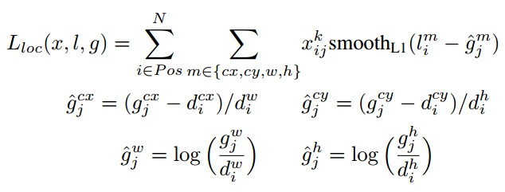
>
>$ 由于 x^p_{ij} 的存在，所以位置误差仅针对正样本进行计算。值得注意的是，要先对ground truth的 g 进行编码得到 \hat{g} ，因为预测值 l 也是编码值，若设置variance_encoded_in_target=True，编码时要加上variance： $

>$ \hat{g}^{cx}_j = (g^{cx}_j - d^{cx}_i)/d^w_i/variance[0], \hat{g}^{cy}_j = (g^{cy}_j - d^{cy}_i)/d^h_i/variance[1]$

>$ \hat{g}^{w}_j = \log(g^{w}_j/d^w_i)/variance[2], \space \hat{g}^{h}_j = \log(g^{h}_j/d^h_i)/variance[3] $

>对于置信度误差，其采用softmax loss:

>

>$ 权重系数 \alpha 通过交叉验证设置为1。$

>（3）数据扩增

>采用数据扩增（Data Augmentation）可以提升SSD的性能，主要采用的技术有水平翻转（horizontal flip），随机裁剪加颜色扭曲（random crop & color distortion），随机采集块域（Randomly sample a patch）（获取小目标训练样本），如下图所示：
>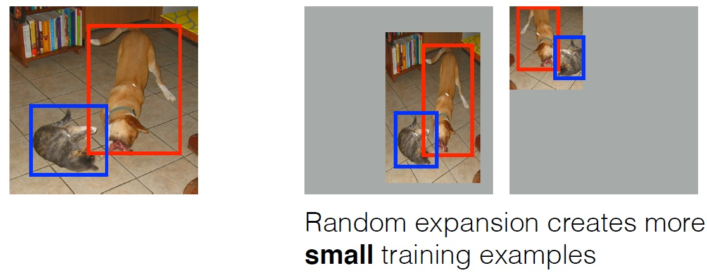
>
>##[返回](#network)


###<span id = "DSSD">DSSD</span>
>[原文](https://blog.csdn.net/Jesse_Mx/article/details/55212179)
>提升检测精度的话，两个途径就是更好的特征提取网络和增加上下文信息，尤其对小物体检测而言更是如此。[SSD](#SSD)方法用的基准网络是VGGNet，要是换成Resnet-101的话就能提升精度，这就更好的特征提取网络。在目标检测研究之外，有一种编码-解码（encoder-decoder ）网络，其中网络中间层加入了输入图像的编码部分，后面再进行解码（就是卷积和反卷积），这样形成的宽-窄-宽的网络结构很像沙漏，FCN就是类似结构，本文就利用反卷积层实现了上下文信息的扩充。
>故文章把SSD的基准网络从VGG换成了Resnet-101，增强了特征提取能力；然后使用反卷积层（deconvolution layer ）增加了大量上下文信息
>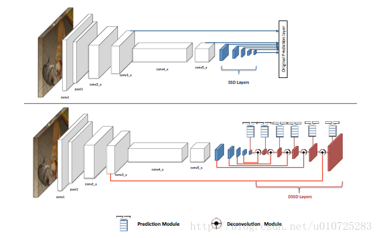
>上图展示了论文的核心思想，也就是如何利用中间层的上下文信息。方法就是把红色层做反卷积操作，使其和上一级蓝色层尺度相同，再把二者融合在一起，得到的新的红色层用来做预测。如此反复，仍然形成多尺度检测框架。在图中越往后的红色层分辨率越高，而且包含的上下文信息越丰富，综合在一起，使得检测精度得以提升。
>SSD的直接从数个卷积层中分别引出预测函数，预测量多达7000多，梯度计算量也很大。MS-CNN方法指出，改进每个任务的子网可以提高准确性。根据这一思想，作者在每一个预测层后增加残差模块，并且对于多种方案进行了对比，如下图所示。结果表明，增加残差预测模块后，高分辨率图片的检测精度比原始SSD提升明显。
>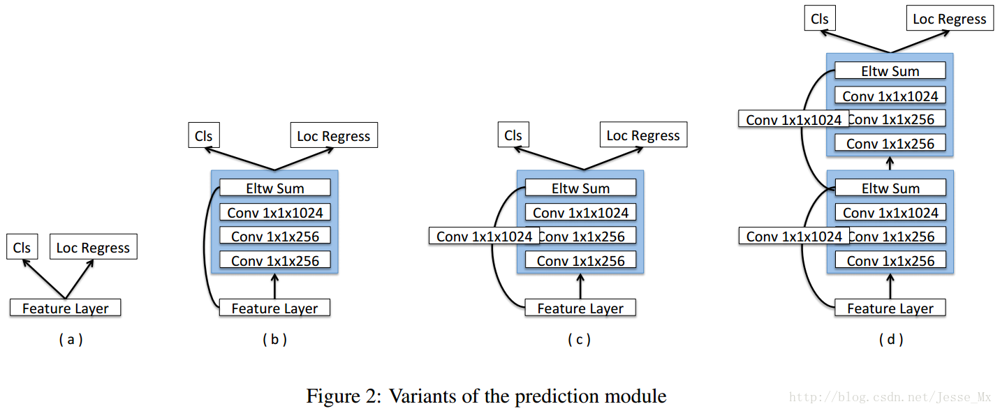
>#####反卷积SSD网络
>为了引入更多的高级上下文信息，作者在SSD+Resnet-101之上，采用反卷积层来进行预测，和原始SSD是不同的，最终形成沙漏形的网络。添加额外的反卷积层以连续增加后面特征图的分辨率，为了加强特征，作者在沙漏形网络中采用了跳步连接（skip connection）方法。按理说，模型在编码和解码阶段应该包含对称的层，但由于两个原因，作者使解码（反卷积）的层比较浅：其一，检测只算是基础目标，还有很多后续任务，因此必须考虑速度，做成对称的那速度就快不起来。其二，目前并没有现成的包含解码（反卷积）的预训练模型，意味着模型必须从零开始学习这一部分，做成对称的则计算成本就太高了。
>#####反卷积模块
>为了整合浅层特征图和反卷积层的信息，作者引入了如figure 3所示的反卷积模块，该模块可以适合整个DSSD架构（figure1 底部实心圆圈）。作者受到论文Learning to Refine Object Segments的启发，认为用于精细网络的反卷积模块的分解结构达到的精度可以和复杂网络一样，并且更有效率。作者对其进行了一定的修改，如Figure 3所示：其一，在每个卷积层后添加批归一化层；其二，使用基于学习的反卷积层而不是简单地双线性上采样；其三，作者测试了不同的结合方式，元素求和（element-wise sum）与元素点积（element-wise product）方式，实验证明点积计算能得到更好的精度。
>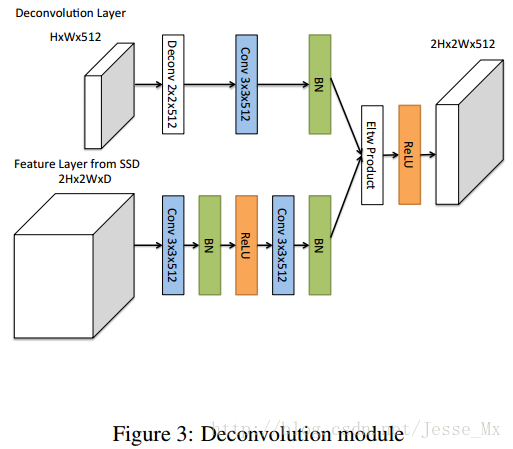
>##[返回](#network)


